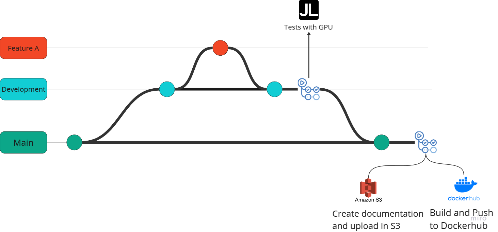
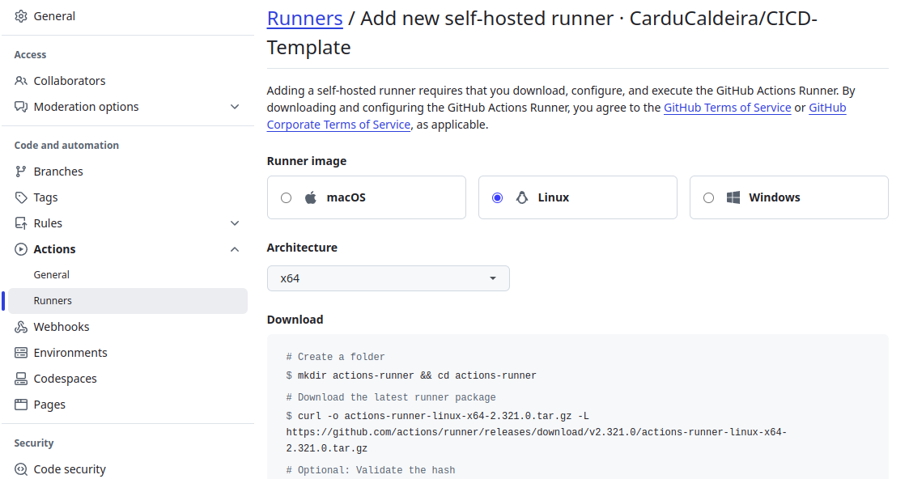

# CICD-to-GPU-Projects

## Descrição do Projeto

Este projeto oferece um **template de pipeline CI/CD** especificamente projetado para projetos que requerem o uso de GPUs. Enquanto o **GitHub Actions** fornece uma estrutura robusta para gerenciar fluxos de trabalho de integração e entrega contínuas, ele não possui soluções nativas para tarefas que exigem processamento gráfico acelerado. Para suprir essa lacuna, este template integra **self-hosted runners** na nuvem [Jarvis](https://jarvislabs.ai/ "https://jarvislabs.ai/")
 , permitindo que os usuários aproveitem os recursos de GPU. 

Para o uso em outros servições cloud a implementação seria similar. Na figura abaixo é apresentado a diagramação do pipeline.

 

## Instalação do Self Hosted no Jarvis

Para o uso do git hub actions self hosted é necessário a instalação no ambiente com GPU que será utilizado, nesse caso uma instância do Jarvis. A instalação pode ser feita conforme a documentação oficial.



Para a instalação do runner foi implementado um script shell (scripts_jarvis/construct_env.sh) para automatizar a sua instalação e possibilitar a correta configuração de ambiente. Como o runner deve ser executado como usuário não root, foi necessário criar usuario e lhe conceder as permissões para o uso das pastas (por limitações do Jarvis essa etapa é necessária):

- /home/.local/share/: O gerenciamento de pacotes Python é realizado por meio da ferramenta uv. Com ouv é possivel instalar uma versão especifica do interpretador python. O binário é salvo em /home/.local/share/uv/python. 

- /home/.cache: O cache dos downloads das bibliotecas python são salvos nesta pasta.

- /home/$USER: Necessário para o uv poder criar o ambiente virtual (.venv) com as bibliotecas instaladas.

No script os campos *** devem ser substituidos pelos campos informados para o seu runner informado pelo github actions.

## Etapas do Pipeline

Como a branch main foi bloqueada para push diretamente, o push só pode ocorrer via pull request de branches auxiliares, como a development. Uma vez triggado o pull request para a main o pipeline (executado em .github/workflows/development.yml) consistirá das seguintes etapas:

- Inicialização da instancia previamente configurada. A iniciação é realizada por meio do script apiclient.py, que conecta com a API do Jarvis e inicia a instancia. Ao iniciar a instancia o script  scripts_jarvis/start_runner.sh é executado na instancia que cria novamente o usuario (a instancia nao tem persistencia fora de /home, portanto o usario criado na configuração do ambiente é perdido apesar das pastas persistirem) e executa o runner. Para executar o script start_runner.sh no Jarvis é necessário o upload previamente do script nas configurações de usuario do Jarvis.

- Testes/Execução no ambinete self hosted.

- Pausa da instancia realizada por meio do script apiclient.py.

Em alguns poucos casos foi observado que a etapa de teste no ambiente self hosted ficou em estado de queue, aguardando o runner aceitar o job. Para contornar essa situação foi implementado um pipeline auxiliar em .github/workflows/timeout.yml que depois de um tempo especificado verifica se tem algum job em estado de queue e caso sim cancela o workflow. A solução implementada foi baseada na discussão https://github.com/orgs/community/discussions/50926, pois a configuração timeout-minutes não é aplicada para jobs em estado de queue. 

Também, apesar de o marketplace do github actions possuir um job que instala o uv, o job para a instalação do uv do ambiente self hosted foi implementa devido as configurações pré-existentes na instancia do Jarvis, que instala o uv por meio do miniconda e devido as limitações de permissão do usuario nao root o melhor caminho foi realizar a instalação do uv diretamente.

Para implementação do pipeline é necessário configurar no github actions:

- Secret TOKEN_JARVIS: utilizado pelo apiclient.py para conectar ao Jarvis.

- Variavel INSTANCE_NAME: Nome da instancia no Jarvis que o apiclient.py ira iniciar/pausar/

- Variavel SCRIPT_NAME: Nome dado ao script apresentado em scripts_jarvis/start_runner.sh no no upload em configurações do Jarvis. O nome do script é necessário para denotar que ele deve ser executado (para iniciar o runner).

- Variavel SLEEP_DURATION: Tempo de espera para o workflow timeout.yml verificar se há algum job em estado de queue.

- Variavel WORKFLOW_NAME: Nome do workflow que timeout.yml irá verificar se há um job em estado de queue.

## Cloud Jarvis

No script python  apliclient.py é realizado a conexão com a API do Jarvis, para mais detalhes verifique a documentação em  [Documentação em jarvislabs.ai](https://docs.jarvislabs.ai/api/ "https://docs.jarvislabs.ai/api/") e [Repositório](https://github.com/jarvislabsai/JLClient "https://github.com/jarvislabsai/JLClient").

## Ferramentas utilizadas: UV e MKDOCS

### UV

Para gerenciamento de pacotes e de projetofoi utilizado o uv. Para verificar sua dodumentação e instalção. Alguns dos comandos utilizados:

- uv python install <versao> (ex: 3.12): O uv faz o gerenciamento das versões python, ao dar o comando ele ira baixar e instalar o interpretador python da versão especificada. Por padrão o
interpretador será baixado em ~/.local/share/uv/python/. Caso já exista um interpretador instalado na versão especificada, como por exemplo em /usr/bin/python3.12 ele irá utilizar o interpretador disponivel.

- uv run: Para rodar um script no enviroment desenvolvido. Para rodar com o comando python basta ativar o ambiente virtual com source .venv/bin/activate.

- uv add: Para instalar uma biblioteca (ao contrário do poetry que o comando add apenas modifica o arquivo pyproject.toml o uv realiza a instalação, atualizando o pyproject.toml, .venv e o uv.lock). Para instalar um biblioteca em um grupo especifico, por exemplo: 
    - uv add --group lint ruff: Nesse caso a biblioteca será instalada pelo grupo lint.
    - O comando uv add --dev pytest é o mesmo que uv add -group dev pytest.

- uv sync: Para instalar as bibliotecas do projeto em pyproject.toml. Nesse caso, o comando uv sync também irá atualizar o arquivo uv.lock. Para casos em que o uv.lock ja foi gerado previamente ou não previsa ser atualizado o comando uv sync --frozen irá instalar a bibliotecas sem gerar o arquivo uv.lock novamente.

Nesse projeto também foi utilizado a variavel de ambiente UV_COMPILE_BYTECODE=1, que sinaliza ao uv para criar arquivos bytecode dos scripts python, aumentando a perfomace nas execuções seguintes dos mesmos scripts.

--------------------

### MKDOCS

A documentação do projeto é realizada por meio do mkdocs, gerando um site estático que quando realizado o pull request na main é atualizada e disponibilizada como uma pagina web. Para gerar um documento no formato pdf é utilizado o mkdocs exporter, esse documento é salvo em um bucket S3.

## Docker

Após a a realização do pull request para a main é realizado o build de uma imagem docker com pytorch e os drivers do cuda. Para esta etapa além da imagem ubuntu de base foram testadas as imagens da nvidia que já possuem os drivers cuda instalados https://hub.docker.com/r/nvidia/cuda/tags, no entento foi observado que após a instalação do pytorch a imagem superou 8GB (em comparação com a imagem Pytorch oficial que possui em torno de 6GB, denpendendo a versão, depois de descomprimida), devido a instalação do cuda pelo pytorch, duplicando alguns arquivos de forma desnecessária.

Como base foi tomado como referencia a imagem runtime do pytorch, construída utilizando multi-stage build em [Dockerfile Pytorch](https://github.com/pytorch/pytorch/blob/main/Dockerfile "https://github.com/pytorch/pytorch/blob/main/Dockerfile") é possível verificar a imagem. A diferença para a imagem construída nesse projeto está sobretudo na substuição do miniconda (utilizado para instalar o pytorch na imagem base ubuntu) pelo uv, dessa forma não foram instalados os pacotes ccache e cmake necessários para a instalação do miniconda.

O Dockerfile desse projeto foi estruturado em multi-stage build. Um ponto relevante é que nesse pipeline o build é realizado após os testes, porém dependendo o contexto o build pode ser vantajoso realizar o build antes dos testes, como apresentado nesse tutorial [Tutorial YouTube](https://youtu.be/aZzV6X7XhyI?si=HwJjvUHOsQ7b16-v "https://youtu.be/aZzV6X7XhyI?si=HwJjvUHOsQ7b16-v"). A diferença no Dockerfile seria a criação de mais um etapa de de build, criando um ambiente de testes com suas respectivas configurações. 

## Estrutura de pastas

A seguir é apresentado a estrutura de pastas do projeto:

```
├── apiclient.py
├── assets
│   └── arch.png
├── Dockerfile
├── pyproject.toml
├── README.md
├── requirements_jarvis.txt
├── src
│   └── main.py
├── tests
│   └── pytorch_test.py
├── uv.lock
├── mkdocs.yml
├── docs
├── .githooks
│   └── pre-commit
└── .github
    └── workflows
        ├── development.yml
        ├── main.yml
        └── timeout.yml
```

- apiclient.py: Script python usado para iniciar/pausar uma instancia no Jarvis.

- requirements_jarvis.txt: Bibliotecas usadas para configurar o ambiente para usar o script apiclient.py.

- scripts_jarvis: Scripts shell utilizados para configurar e iniciar a instancia no Jarvis.

- .github/workflows: Scripts de implementação do pipeline.

- .githooks: 

- src/main.py:  Script python de exemplo.

- tests/: Pasta de testes.

- docs: Pasta com arquivos utilizados para gerar a documentação do projeto.

- mkdocs.yml: Arquivo de configuração do mkdocs.

- Dockfile: Dockerfile usado para buildar a imagem com cuda e pytorch.

